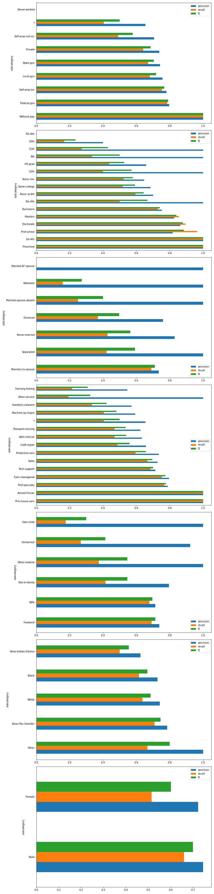
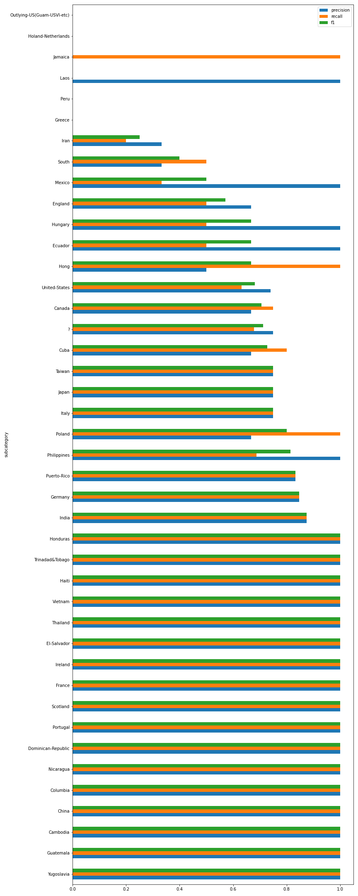

# Model Card

For additional information see the Model Card paper: https://arxiv.org/pdf/1810.03993.pdf

## Model Details

The model is a simple random forest, with categorical features encoded using `OneHotEncoding` as it was provided on the data preprocessing pipeline.

## Intended Use

To predict whether a person has a salary greater than 50K USD.
## Training Data

We used: [census.csv](https://github.com/danpereda/deploying_scalable_ml_pipeline/blob/0943e3519f168b5f545ac0bdfed17dea4fe5a9f3/data/census.csv) as our full data.

For training data we split by doing sklearn's `train_test_split` with `random_state = 42`

## Evaluation Data

For evaluation data we use the evaluation split done in the previous part.

## Metrics

The metrics used are: precision, recall and fbeta score (in this case with beta = 1) as it is an imbalanced classification problem without a preference on precision or recall.

- precision : 0.793301
- recall: 0.638087
- f1: 0.66745

Metrics on slices can be seen in the following images.

And slicing by country:

You can see all metrics on slices on 

## Ethical Considerations

Train dataset is highly bias. For example, if you group by race, then black and amer-indian-eskimo have a much lower representation on the high salary range, thus, it is more likely to predict a person from this race will have a lower salary. This is something that should be take care off to increase the fairness of our model.

## Caveats and Recommendations

The point of this work was to build an scalable ml pipeline, therefore the model is not really high performant, my recomendations to improve the model and pipelines are:

- Do not use `OneHotEncoder`, instead use a model that can take care of it by itself or make use of `TargetEncoding` with a tree-based model.
- Do not save the encoder by itself, instead make an inference pipeline with both the encoder and the model.
- Instead of `RandomForest` use `LightGBM` (or `XGBoost` or `CatBoost`)
- Do an hyperparam optimization including model weights to take into account class imbalance.
- Try some oversampling and undersampling algorithms from `imblearn` package.